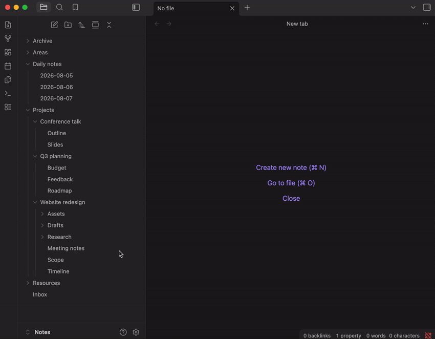

# Explorer Order Editor

Put the folders and notes inside a folder in the order you want, by dragging
them in the file explorer itself. No renaming, no number prefixes, and the
order is kept in your vault rather than in `.obsidian/` — so sync setups that
exclude that folder (Dropbox, for example) keep it.



> Works on its own, with nothing else to install. The order lives in one
> plain-text note inside your vault: it syncs with your notes, diffs in
> version control, and can be read or edited by hand.

## Four ways to reorder

All four write to the same place, so you can mix them freely.

**Drag a row in the file explorer.** Drop it on the **top or bottom edge** of
another row — a line shows where it will land. Dropping on the **middle** of a
folder row still moves the item into that folder, exactly as it always has. An
edge drop inside a different folder does both at once: the item moves there
*and* lands in that spot rather than at the end. Holding a drag near the top or
bottom of the list scrolls it, faster the closer to the edge you get.

**Arrange a whole folder in a dialog.** Right-click a folder and choose
**Explorer order → Set order**, drag its children into place, then **Save**.
**Clear order** appears beside it only when that folder has an order to remove.
For the vault root, right-click the empty space below the last row, or use the
**Set explorer order for vault root** command.


**Nudge one item from the right-click menu.** **Move up**, **Move down**,
**Move to top** and **Move to bottom** work on any file or folder, and only the
ones that would actually do something are offered. They are **off by default**,
since dragging a row already does the same job and four extra entries is a lot
to add to a menu you open constantly. **Show move actions in the file
explorer menu** turns them on.

**Nudge one item with a hotkey.** The same four are commands, bindable whether
or not the menu shows them. Which item a hotkey moves follows the keyboard: the
row the file explorer has focused while you are in the tree, and the note you
have open otherwise. That is also what lets a hotkey move a **folder**, since
the note you have open never is one.

## Inside the dialog

It works on mobile as well as desktop — drag a row by its grip handle, using a
long press on touch. Dragging is not the only way to move a row: each one has
buttons that send it straight to the top or bottom, and on desktop
`Alt`+`↑`/`Alt`+`↓` nudge the focused row a step at a time while
`Alt`+`Shift`+`↑`/`Alt`+`Shift`+`↓` send it to either end.

You don't have to build an order from scratch. **Sort by**, at the end of the
path line, arranges the rows by name, creation date or modification date in
either direction; sort by a date and each row shows the date it was sorted on.
Folders always come first, because Obsidian records no dates for them at all.
Sorting rearranges the dialog and nothing else — **Save** keeps the result,
**Cancel** leaves the folder as it was. What you save is that arrangement, not
a rule that keeps re-applying: a file added later joins the end.

Because an order covers one folder at a time, the dialog also lets you walk the
tree without closing it: every folder row has an arrow button that opens that
folder, and each level of the path at the top is clickable. Nothing is saved
behind your back — if you have dragged rows, the button you are about to click
reads **Save and open "…"** and does exactly that; if you have touched
nothing, opening a folder writes nothing at all.

## What an order covers

One folder only; an order does not cascade. Ordering `Projects` rearranges the
items directly inside it, while `Projects/Client A` keeps sorting as it did
until you give that folder its own order.

Moving an item in a folder you have never ordered simply records the order you
can already see, with that one item moved — you never have to arrange a whole
folder before you can nudge one thing in it. Names the order doesn't mention
keep whatever position Obsidian's own sort setting gives them, so an ordered
folder still respects your choice of name, modified time or anything else for
everything you didn't place by hand.

Renaming an item keeps its position, and deleting it — or moving it out of the
folder — drops it from the order. Moving an item *into* a folder keeps the
spot you dropped it on if you dropped it on an edge; any other kind of move
has nothing to say about where you wanted it, so it joins the end.

## Where the order is stored

One note for the whole vault — `explorer-order.md` at the root by default —
in a fenced `json` block, one folder per line:

```json
{
  "Projects/Alpha": ["Design.md", "Notes", "TODO.md"],
  "Projects/Beta": ["b.md", "a.md"]
}
```

Names are exactly as they appear in the vault, extensions included, and any
name can be stored whatever characters it contains. Anything unlisted sorts to
the end, so you only pin what you care about. One line per folder is
deliberate: a three-way merge in git then resolves conflicts per folder rather
than on the whole file. Only the contents of that one block are ever
rewritten — any prose you add around it, and any other block, is left
byte-for-byte alone. If the block cannot be parsed, the plugin says so and
**refuses to write** until you fix it, rather than overwriting a file it could
not read.

## Settings

- **Automatically refresh after saving** (on) — redraw the file explorer as
  soon as an order changes. With it off, the change is still written
  immediately and shows up at the explorer's next refresh.
- **Hide the order note in the file explorer** (on) — keep `explorer-order.md`
  out of the tree, since it is a byproduct of using the plugin rather than
  something you wrote. Search, the quick switcher and the graph still show it.
- **Drag to reorder in the file explorer** (on) — turn it off to leave the
  tree's drag-and-drop exactly as Obsidian ships it.
- **Show move actions in the file explorer menu** (off) — the four move
  entries above. The commands stay bindable to hotkeys either way.

Four more rows appear only when there is something for them to do: **Repair the
order note**, **Delete the kept copies of unreadable order notes**, **Remove
orders for missing folders**, and **Clear every saved order** — which confirms
first, naming how many folders are affected, and never touches your files.

## If the order note can't be read

A bad hand edit or a sync conflict can leave the note unparseable. The plugin
says so and stops writing, but it does not touch the file: a note being edited
by hand passes through invalid JSON on every autosave, and healing at that
moment would overwrite what you were typing.

It repairs the next time you actually ask for something — saving an order, or
the **Repair the order note** row. The unreadable text is copied to a note
beside it first, so nothing is destroyed to make room, and what gets rebuilt is
the union of three sources: whatever can still be read from the broken note
line by line, whatever the plugin has in memory, and a backup it keeps in its
own plugin data. One folder per line means a single mangled line costs one
folder rather than the file, and git conflict markers leave both sides' folders
intact. If none of the three yields anything, the note is left exactly as it
is — a repair never replaces your only copy with an empty one.

Two other messages mean something else. If an order could not be written — a
full disk, a locked file — the plugin says so and keeps showing the new order,
so fix the cause and reorder something soon after: that writes everything the
session is still holding. If it says it could not read its own `data.json`,
your saved orders are safe in the note, but settings show their defaults and
changes to them will not stick until it can be read: repair or delete that
file and the plugin picks it up by itself, or press **Read it again** in its
settings.

## Known limitations

- An order is keyed by folder path, so a folder renamed or moved **while this
  plugin isn't running** — on another device, or with the plugin disabled —
  leaves its order under a path nothing lives at any more. Renames made while
  it is running are followed automatically. Orders for folders that no longer
  exist are kept rather than pruned, since a missing folder is just as likely
  to be sync lag as a real deletion; **Remove orders for missing folders**
  clears them when you are sure.
- Every order lives in one file, so two devices reordering different folders at
  the same time can produce a sync conflict on it, where a per-folder layout
  would not. Obsidian Sync leaves a conflict copy; a git merge resolves per
  folder.
- The saved order is rendered by wrapping a method inside Obsidian's file
  explorer, which is not part of its public API, so an Obsidian update could in
  principle stop it working. The wrapper is written to fail quietly — on
  anything unexpected it hands back the explorer's own ordering untouched — so
  the worst case is that a saved order stops being applied, never a broken file
  tree.
- There is no multi-select drag; reordering is one row at a time.

## Installation

In Obsidian, open **Settings → Community plugins → Browse**, search for
**Explorer Order Editor**, then install and enable it. There is nothing to
configure before it works.

From 0.5.0 onward this plugin needs **Obsidian 1.13 or newer**. On an older
Obsidian you are offered 0.4.2 instead, which is complete and fully working;
you simply stop receiving updates until you update the app. To track
pre-release builds, point
[BRAT](https://github.com/TfTHacker/obsidian42-brat) at
`https://github.com/vcarus/obsidian-explorer-order-editor`.

## Contributing

Development setup, the source layout and the release process are in
[CONTRIBUTING.md](./CONTRIBUTING.md).

## License

MIT — see [LICENSE](./LICENSE).
