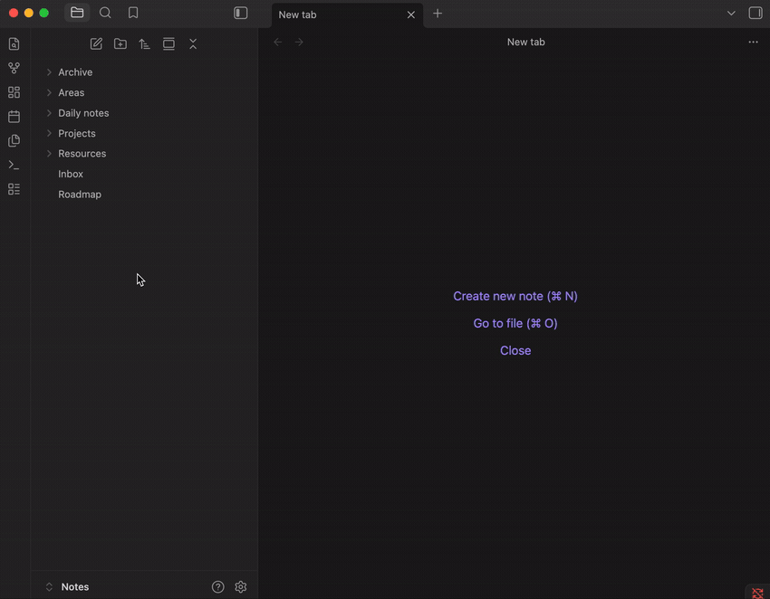
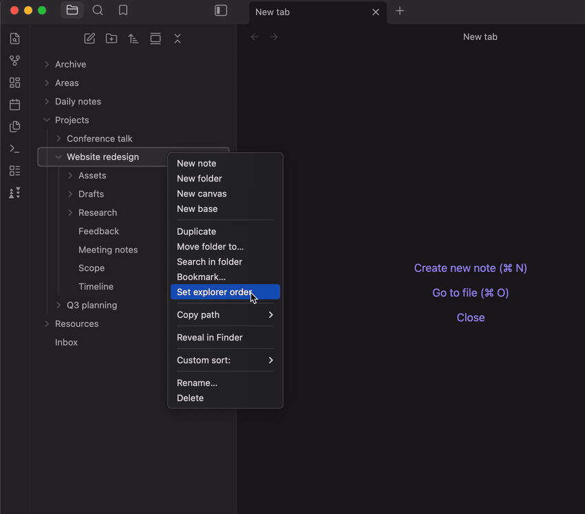

# Explorer Order Editor

An Obsidian plugin for setting a manual, drag-and-drop order for the folders
and notes inside a folder, without renaming files and without storing the
order somewhere that sync setups excluding `.obsidian/` (Dropbox, for
example) would drop.



> Works on its own — no companion plugin needed. If you already use
> [Custom File Explorer sorting](https://obsidian.md/plugins?id=custom-sort),
> this plugin writes a spec it understands and leaves the rendering to it.
> See [below](#rendering-and-custom-file-explorer-sorting).

## What it does

Right-click a folder and choose **Set explorer order** to get a dialog
listing its direct children; drag them into the order you want and **Save**.
The order is written to a `sortspec.md` inside that same folder. **Clear
explorer order**, in the same menu, removes it again — it only appears when
there is something of this plugin's to remove.

For the vault root, right-click empty space below the last item in the file
explorer. There are also **Set explorer order for vault root** and **Clear
explorer order for vault root** commands, for binding a hotkey or for a
layout with no empty space left to click.

An order applies to **one folder only**; it does not cascade. Ordering
`Projects` rearranges the items directly inside it, while `Projects/Client A`
keeps sorting as it did until you give that folder its own order. There is
nothing to cascade — a manual order is a list of specific names, and those
names don't exist in the folders below.

So arranging a whole tree means visiting each folder in turn, which is why
the dialog lets you walk the tree without closing it. Every folder row has a
**›** button that opens that folder, and each level of the path at the top is
clickable, so getting from four levels deep back to the vault root is one
click rather than four. Nothing is saved behind your back: if you have
dragged rows, the control you are about to click says **Save and open "…"**
and does exactly that; if you have not touched anything, opening a folder
writes nothing at all.



The dialog works on mobile as well as desktop — drag a row by its grip
handle, using a long press on touch. Dragging is not the only way to move a
row: each one has buttons that send it straight to the top or bottom, and on
desktop `Alt`+`↑`/`Alt`+`↓` nudge the focused row a step at a time while
`Alt`+`Shift`+`↑`/`Alt`+`Shift`+`↓` send it to either end.

Renaming an item keeps its position, and deleting it — or moving it out of
the folder — drops it from the order. Expect a brief flicker on rename: the
file explorer redraws before `sortspec.md` has been updated, so the renamed
item sits at the bottom for about half a second and then returns. Moving an
item *into* a folder does not insert it into that folder's order: there is no
way to know where you would want it, so it joins everything else the order
doesn't mention, at the end.

## Rendering, and Custom File Explorer sorting

This plugin renders the saved order in the file explorer itself, so nothing
else needs to be installed. It does that by wrapping the file explorer's
internal `getSortedFolderItems` — the same method
[Custom File Explorer sorting](https://github.com/SebastianMC/obsidian-custom-sort)
(`custom-sort`) wraps for the same purpose. Names the stored order doesn't
mention keep whatever position Obsidian's own sort setting gives them, so a
folder you have ordered still respects your choice of name, modified time or
anything else for everything you didn't place by hand.

That method is not part of Obsidian's public API, so the wrapper is written
to fail quietly: on any unexpected result it hands back the file explorer's
own ordering untouched. The worst case is that a saved order stops being
applied, never a broken file tree.

If `custom-sort` is installed and enabled, this plugin detects it and stays
out of the way completely — that plugin does the rendering, and the two can
never disagree about a folder. Nothing about what gets written changes
either way, because what gets written is a spec `custom-sort` reads. That is
deliberate: the order stays plain text your vault owns, it keeps working if
you ever remove this plugin and keep `custom-sort`, and `custom-sort` covers
kinds of sorting this plugin does not try to offer.

After a save or a clear, the file explorer is asked to redraw right away —
`custom-sort`'s refresh command when it is present, the explorer's own
re-sort when it isn't. That can be turned off in settings.

## How the order is stored

Each folder's order lives in a `sortspec.md` file inside that same folder
(the vault root's is just `sortspec.md` at the top level), under a
`sorting-spec` front matter key that `custom-sort` reads:

```yaml
---
sorting-spec: |
  target-folder: .
  // explorer-order-editor
  Meeting notes
  Requirements
  Subproject
  Archive
---
```

It is plain text in your own vault, so it syncs like any other note and
survives this plugin being uninstalled. A few things worth knowing:

- Notes are listed without their `.md` extension; every other file keeps its
  extension; folders use their plain name.
- Anything in the folder that isn't listed sorts to the end — you don't have
  to list everything, only what you want to pin.
- The `// explorer-order-editor` marker identifies a section this plugin
  wrote. **Clear explorer order** can only ever delete a marked section, so
  it cannot remove configuration you wrote by hand. Saving is less
  conservative: it replaces a hand-written section for the same folder, and
  the notice afterwards tells you it did.
- If a section covers this folder *together with others* (a multi-folder
  `target-folder:`), saving is refused outright rather than rewriting it,
  since editing it here would silently change those other folders too.
- Only the `sorting-spec` key and the file's own existence are ever touched.
  Other front matter keys, and any body text, are left byte-for-byte alone.

## Settings

The settings tab opens with a status row showing whether `custom-sort` was
detected, and therefore which of the two is rendering your order. Either
answer is fine; it is there so you know which one to look at if something
seems off.

- **Automatically refresh after saving** (on by default) — update the file
  explorer as soon as an order is saved or cleared. When off, the change is
  still written immediately and shows up at the explorer's next refresh.
- **Hide sortspec.md in the file explorer** (on by default) — hide
  `sortspec.md` from folders where you've saved an order, so ordering twenty
  folders doesn't put twenty files into your tree. Both renderers honour
  this: the setting writes `custom-sort`'s own item-hide syntax, and this
  plugin's own rendering applies it too. Only the file explorer is affected;
  search, the quick switcher and the graph still show the file. Turn this off
  to see it in place. Toggling applies immediately across the vault, in both
  directions: every section this plugin wrote is updated, and sections you
  wrote by hand are left alone.

## Known limitations

- A few names cannot be expressed in `custom-sort`'s syntax, which has no
  escape mechanism: names containing `...`, names with leading or trailing
  whitespace, and names whose first word is one of its reserved tokens
  (`%`, `/folders`, `--%`, `with-metadata:` and their relatives). The dialog
  lists these separately, below the orderable rows, each with a tooltip
  saying why; they aren't draggable, and like anything unlisted they sort to
  the end. Everything else still saves, and the notice afterwards names what
  was skipped. Names that merely *start* with such a token as part of a
  longer word — `%Report`, `--dashes` — are fine.
- `custom-sort` also reads a folder note (`FolderName/FolderName.md`, if one
  exists) as a sorting spec for that same folder. If that note has its own
  `sorting-spec` targeting the folder it lives in, it's a second,
  independent source of truth this plugin cannot reconcile — the dialog
  warns about it, but never edits the folder note.
- A rename can only be followed while this plugin is running. One made on
  another device, or with Obsidian closed, arrives as an already-renamed
  file, and that item loses its position — it sorts to the end until you drag
  it back. The stale name is dropped the next time that folder is saved.
- There is no multi-select drag; reordering is one row at a time.
- The order the dialog suggests for a folder with no saved order — folders
  first, then files, each by name with digit runs compared as numbers —
  approximates the file explorer rather than matching it. The dialog reads
  the folder from the vault rather than from the explorer, so if you've set
  the explorer to anything other than name A→Z, the dialog's starting order
  will differ from what you see in the tree. It's a starting point to drag
  from; once saved, the order is explicit and identical everywhere. (The
  rendered result does follow your sort setting for anything you didn't
  place by hand — this is only about the dialog's initial suggestion.)
- The filename `sortspec.md` is fixed. `custom-sort` always reads that
  specific name, so making it configurable would risk silently writing a file
  it never looks at.

## Installation

In Obsidian, open **Settings → Community plugins → Browse**, search for
**Explorer Order Editor**, then install and enable it.

That is the whole installation. If you also want the automatic and
rule-based sorting that
[Custom File Explorer sorting](https://obsidian.md/plugins?id=custom-sort)
offers, install it from the same list; this plugin will detect it and hand
the rendering over — see above.

From 0.5.0 onward this plugin needs **Obsidian 1.13 or newer**, which is what
lets its settings be declared to Obsidian rather than drawn by hand — that is
the form Obsidian's own settings search can read. On an older Obsidian you are
offered 0.4.2 instead, which is complete and fully working; you simply stop
receiving updates until you update the app.

To track pre-release builds instead, point
[BRAT](https://github.com/TfTHacker/obsidian42-brat) at
`https://github.com/vcarus/obsidian-explorer-order-editor`.

## Contributing

Development setup, the source layout and the release process are in
[CONTRIBUTING.md](./CONTRIBUTING.md).

## License

MIT — see [LICENSE](./LICENSE).

This plugin is not a fork of, and contains no code from,
[Custom File Explorer sorting](https://github.com/SebastianMC/obsidian-custom-sort)
(GPL-3.0). It is an independent implementation that writes a configuration
file in the format that plugin reads, and asks it to refresh through a
command registered with Obsidian. The two are separate programs that
communicate through a data file; no linking is involved.
